# Vibrexcup 통합 설계·기획서

> **문서 성격**: 현재 구축된 시스템 전체(설계·구현·운영)와 사업 기획(서비스 기획서 · BM 기획서 · 마케팅 기획서)을 한 파일에 담은 마스터 문서
> **기준일**: 2026-09-09 (코드베이스 `master` 브랜치 실측 기준)
> **운영사**: Purilab(퓨리랩) · 도메인 `vibrexcup.com` · 문의 `dev@puritechlab.com`
> **작성 방식**: 소스 코드·마이그레이션·설계 스펙(`docs/superpowers/specs`)·기존 학습 가이드(`docs/vibrex-ai-learning-guide.html`)를 전수 조사해 작성. 코드에 없는 내용(제안·로드맵)은 "제안"으로 명시.

---

## 목차

1. [서비스 개요](#1-서비스-개요)
2. [서비스 기획서](#2-서비스-기획서)
3. [시스템 아키텍처](#3-시스템-아키텍처)
4. [스튜디오: 프롬프트 → 게임 생성 파이프라인](#4-스튜디오-프롬프트--게임-생성-파이프라인)
5. [보편 행동 공간(UAS)과 표준 관찰 슬롯](#5-보편-행동-공간uas과-표준-관찰-슬롯)
6. [AJ: AI 스트리머 시스템](#6-aj-ai-스트리머-시스템)
7. [AI 아바타 학습 방식](#7-ai-아바타-학습-방식)
8. [점토(Jeumto) 아바타 시스템](#8-점토jeumto-아바타-시스템)
9. [파일럿 엔진군: AI 자율 운영](#9-파일럿-엔진군-ai-자율-운영)
10. [역할 정의(R&R)](#10-역할-정의rr)
11. [BM 기획서](#11-bm-기획서)
12. [마케팅 기획서](#12-마케팅-기획서)
13. [모바일 앱](#13-모바일-앱)
14. [운영·배포·보안·법무](#14-운영배포보안법무)
15. [리스크·기술부채·로드맵](#15-리스크기술부채로드맵)
16. [AGI 로드맵 ①: 자율 게임 디자이너 루프](#16-agi-로드맵--자율-게임-디자이너-루프)
17. [부록](#17-부록)

---

## 1. 서비스 개요

### 1.1 한 줄 정의

**Vibrexcup(비브렉스컵)** 은 프롬프트 한 줄로 HTML5 게임을 만들고(Studio), AI 스트리머 **AJ**가 그 게임을 실시간 중계·플레이·분석·홍보하며, 회원의 **AI 아바타가 게임을 스스로 학습**해 대신 플레이하는 **AI 바이브코딩 게임 플랫폼**이다.

### 1.2 핵심 가치 제안 (3 Phase, `/about` 기준)

| Phase | 슬로건 | 내용 |
|---|---|---|
| 01 | REMEMBER & CREATE | 코딩 없이 프롬프트로 게임 제작. 생성 1회 = 프롬코인 10 |
| 02 | AI STREAMS YOUR GAME | AI 스트리머 AJ가 방송·중계·응원, AI 아바타가 대신 플레이 |
| 03 | YOUR AGENT, YOUR INCOME | 조회수·플레이·코인이 쌓이면 수익 창출 기회(토너먼트·광고·토큰 스냅샷) |

### 1.3 제품 구성 한눈에

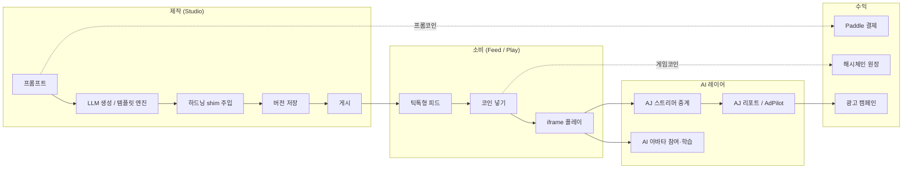

---

## 2. 서비스 기획서

### 2.1 문제 정의

| 대상 | 문제 |
|---|---|
| 게임을 만들고 싶은 일반인·학생 | 코딩·에셋·배포 장벽이 높다. 만들어도 봐줄 사람이 없다 |
| 소규모 크리에이터 | 게임을 만들어도 방송·마케팅·분석을 혼자 할 수 없다 |
| 플레이어 | 짧게 즐길 캐주얼 웹게임을 발견할 채널이 파편화되어 있다 |
| 교육기관·기업 | 바이브코딩 교육 커리큘럼과 결과물을 공유·경쟁할 무대가 없다 |

### 2.2 솔루션

1. **프롬프트 게임 제작**: 단일 HTML 완결 게임을 LLM(claude-sonnet-5)이 생성. 자주 나오는 장르는 정적 템플릿 9종 + DB 템플릿으로 **LLM 호출 없이** 즉시 제공(개인화 색조·제목 변형).
2. **플랫폼 표준 계약(VIBREX_GAME)**: 모든 게임이 같은 조작 어휘(UAS)·관찰 슬롯·이벤트(AJ.score 등)를 노출 → 하나의 AI가 모든 게임을 이해.
3. **AJ AI 스트리머**: 장르별 페르소나 + 크리에이터 아바타가 게임을 중계·대화·응원. 시청자의 AI 에이전트도 대화에 참여.
4. **AI 아바타 학습**: 신경진화(MLP 유전 알고리즘) + 규칙 정책(LLM 컴파일) + 커리큘럼 + 인간 모방 + 자기 반성. 게임×회원 단위로 성장.
5. **아케이드 경제**: 게임코인(vcoin)으로 "코인 넣기", 프롬코인(credit)으로 제작. 코인 변동은 해시체인 원장에 기록.
6. **AI 자율 운영(파일럿 엔진군)**: 원가 라우팅(TokenPilot), 템플릿·대화 학습(MLPilot), AI 검색 노출(LLMPilot), 광고 자동화(AdPilot), 스팸 심사·자동 공지·자동 블로그.

### 2.3 타깃 사용자

| 세그먼트 | 니즈 | 진입 포인트 |
|---|---|---|
| **크리에이터**(10~30대, 바이브코딩 입문자) | 빠르게 만들고 자랑하기 | 홈 히어로 프롬프트 → `/studio` |
| **플레이어/시청자** | 스낵 게임 + 스트리머 감성 | 피드 스와이프 → 코인 넣기 |
| **학생·학교** | 수업·워크숍·학교 대항전 | 토너먼트 학교전, 파트너 프로그램 |
| **기업** | 사내 대항전·브랜딩·기술 협력 | 회사전, 파트너 인바운드 |
| **광고주(게임 홍보자)** | 내 게임 노출 | AJ AdPilot 캠페인 |
| **B2B 개발사** | LLM 원가 라우팅 API | TokenPilot estimate API |

### 2.4 핵심 기능 목록 (구현 완료 기준)

| 영역 | 기능 | 상태 |
|---|---|---|
| 제작 | 프롬프트 생성·수정, 조작안 제안(plan), 이미지 3장·사운드 2개 첨부, 버전 관리, 학습 노트(코드·시나리오 설명), 게시, 썸네일 자동 생성, 훅 문구(티저) 자동 생성 | ✅ |
| 제작 | 정적 템플릿 9종 + DB 템플릿 라이브러리(관리자 승인), 개인화(제목·색조) | ✅ |
| 제작 | 외부 링크 게임 등록(`/submit`) + 프록시 플레이(브리지 주입) | ✅ |
| 소비 | 틱톡형 피드(모바일 스냅/데스크톱 카드), 장르·검색, 좋아요·공유·컬렉션, 라이브 카드 삽입, 광고 카드 삽입 | ✅ |
| 소비 | 아케이드 코인 넣기(vcoin), 코인 티켓 10분, 조회수·세션 텔레메트리 | ✅ |
| AI | AJ 중계·채팅(스트리밍), 게임 이벤트 반응, TTS(ElevenLabs), 유저 에이전트 대화 | ✅ |
| AI | 아바타 게임 참여(스킨 주입·오토파일럿), 신경진화·규칙·커리큘럼·모방·자기반성 학습, 학습 대시보드(3D 신경망·XP 티어) | ✅ |
| AI | AJ 리포트(재미 점수·퍼널·개선 프롬프트·방송 대본·수익 아이디어) | ✅ |
| 아바타 | three.js 점토 에디터(조각·페인트·파츠), 사진→아바타 레시피(비전), 스냅샷 3종 | ✅ |
| 방송 | 폰 카메라 WebRTC P2P 방송, YouTube/Twitch 링크 방송, 라이브 발견 | ✅ |
| 수익 | Paddle 크레딧 팩 3종, 웹훅 지급·환불·차지백, 영수증 | ✅ |
| 수익 | AdPilot 광고 캠페인(CPC 경매, 자동 크리에이티브, ROAS) | ✅ |
| 성장 | 토너먼트 4부문 신청, 파트너 인바운드, 블로그(자동 출시 노트), 공지, SEO·AI SEO(llms.txt) | ✅ |
| 운영 | 관리자 22개 화면, AI 대시보드(automation 13 스위치), 원가 대시보드, 보안·해시체인·로그 | ✅ |
| 앱 | Expo WebView 셸(iOS/Android), 구글 로그인 딥링크, 네이티브 탭바, 스토어 정책 대응 | ✅ (스토어 심사 대기) |
| 미구현 | 게임코인 충전, 크리에이터 현금 정산, AJ 방송 내 광고 삽입, 온체인 앵커링, Vercel Cron | ⏳ |

### 2.5 사용자 여정 플로우차트

#### (a) 신규 방문자 → 가입 → 첫 플레이

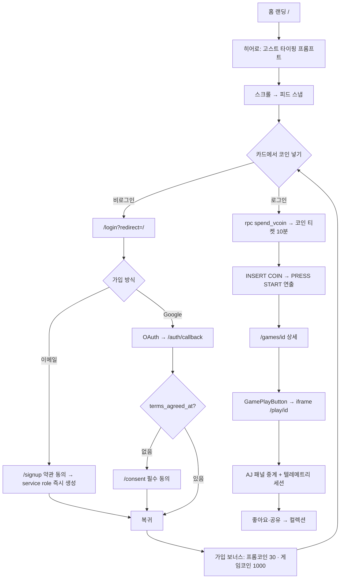

#### (b) 크리에이터 → 스튜디오 → 게시 → 공유

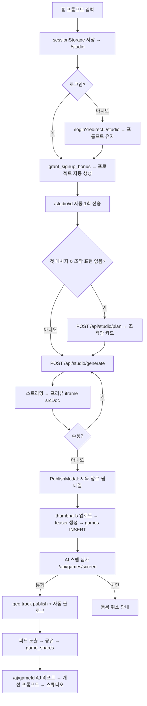

#### (c) 시청자 → AJ 방송 → 채팅 → 아바타 참여

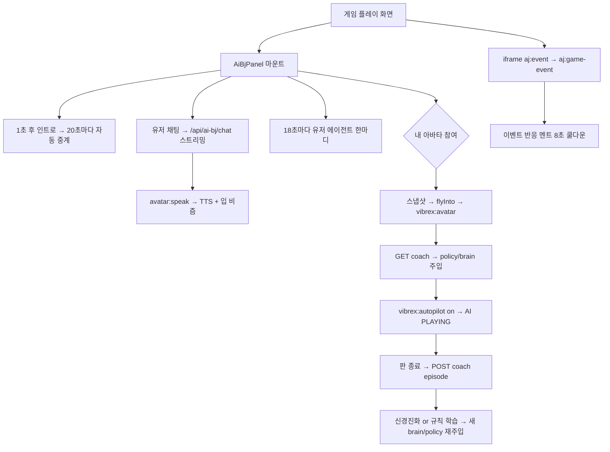

#### (d) 모바일 앱 → 구글 로그인 → 플레이

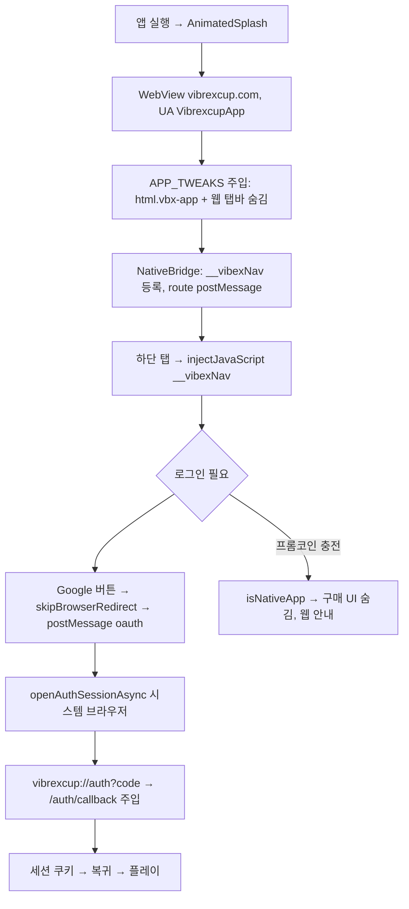

### 2.6 차별점

- **표준 계약 기반 AI 전이**: 조작을 UAS 고정 채널로 강제 → 게임이 늘어도 신경망 출력 크기 고정 → 하나의 두뇌 구조가 모든 게임에 전이.
- **LLM 원가를 구조적으로 억제**: 템플릿 엔진(LLM 0토큰) + 모델 라우팅 + 원가 가드(매출 대비 60% 초과 시 자동 차단).
- **AI가 운영까지**: 스팸 심사, 자동 공지, 자동 블로그, 광고 크리에이티브, 대화 학습 등 13개 자동화 모듈을 사람이 on/off.
- **아케이드 경제 + 해시체인**: 코인 변동을 append-only 해시체인에 기록해 토큰 스냅샷 배분을 준비.

### 2.7 릴리스 이력(요약)

| 시기 | 마일스톤 |
|---|---|
| 2026-05 | MVP(게임 목록·장르·인증), AJ 채팅 패널 |
| 2026-06 | 점토 아바타 컴포저 |
| 2026-07 | 스튜디오(프롬프트 생성·크레딧·Paddle), 홈 프롬프트 우선 히어로, 관리자·블로그, 토너먼트·파트너, kick 스타일 레이아웃 |
| 2026-08 | 게임코인·티저·자동 블로그, AJ 텔레메트리·리포트, 결제 관리, 광고(AdPilot), 지도보드, 로그·보안·해시체인, MLPilot v1/v2, TokenPilot, 표준 매니페스트·UAS, 학습 커리큘럼·신경진화, 모바일 앱 |
| 2026-09 | 주식 떡상 템플릿, 러너 이단점프 변형, 마스코트 로더, 앱 스토어 자산 |

---

## 3. 시스템 아키텍처

### 3.1 기술 스택

| 계층 | 기술 |
|---|---|
| 프런트/서버 | Next.js 16.2 (App Router, `proxy.ts` 미들웨어), React 19, TypeScript 5, Tailwind CSS v4(CSS-first), zustand |
| DB/Auth/Storage/Realtime | Supabase (PostgreSQL + RLS, Auth, Storage 버킷 3개, Realtime broadcast/presence) |
| LLM | Anthropic SDK (`claude-sonnet-5`, `claude-haiku-4-5`, 비전) |
| 결제 | Paddle (Merchant of Record) — Paddle.js 오버레이 체크아웃 + 웹훅 |
| 음성 | ElevenLabs TTS 프록시 |
| 메일 | Resend |
| 3D | three.js (점토 에디터, 3D 신경망 시각화), topojson + world-atlas(지도보드) |
| 호스팅 | Vercel (회원 앱 `vibrax`, 관리자 앱 `vibrax-admin` — 동일 코드베이스) |
| 모바일 | Expo 52 + react-native-webview (WebView 셸) |
| 테스트 | `node --test` (`lib/**/*.test.ts` 9개) |

### 3.2 배포 토폴로지

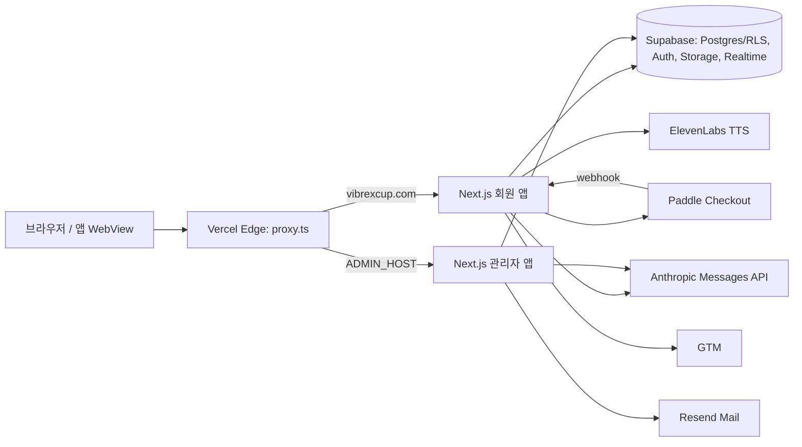

`proxy.ts` 처리 순서: ① 관리자/회원 호스트 분기 → ② `?code=` OAuth 회수 → ③ AI 학습봇 UA 403 → ④ 점검 모드(IP 허용목록, 503 rewrite, 웹훅 예외) → ⑤ `/submit` 로그인 게이트.

### 3.3 요청 흐름(전역)

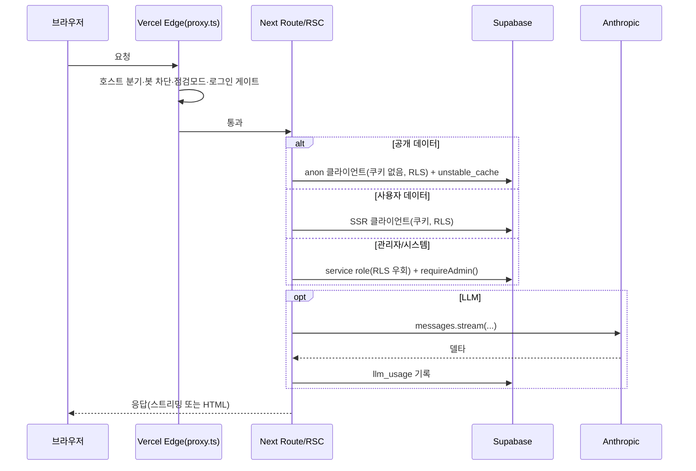

### 3.4 라우트 맵(요약)

**페이지 53개** — 공개(`/`, `/games`, `/games/[id]`, `/about`, `/blog`, `/notices`, `/tournament`, `/partner`, `/credits`, `/maintenance`, `/offline`), 인증/법무(`/login`, `/signup`, `/forgot-password`, `/reset-password`, `/consent`, `/terms`, `/privacy`, `/refund`, `/marketing-consent`), 회원(`/studio`, `/studio/[id]`, `/submit`, `/profile`, `/avatar`, `/broadcast`, `/ads`, `/aj/[gameId]`), 관리자 22개(`/admin`, `/admin-ops`, `/admin/{map,games,blog,notices,members,broadcasts,applications,templates,aj,payments,access,security,logs,legal,settings,ads,mlpilot,llmpilot,costs}`).

**API 47개** — 그룹별:

| 그룹 | 라우트 |
|---|---|
| 관리자 | `/api/admin/{access,automation,broadcasts,costs,legal,llmpilot,logs,members,mlpilot,mlpilot/talk,payments,roles,security,templates,tokenpilot}` |
| 인증 | `/api/auth/{signup,forgot,consent}`, `/auth/callback` |
| 스튜디오·LLM | `/api/studio/{generate,plan,explain}`, `/api/teaser`, `/api/avatar/from-image`, `/api/tts`, `/api/tokenpilot/estimate` |
| AJ | `/api/ai-bj/{chat,coach,learning}`, `/api/aj/analyze`, `/api/user-agent/chat`, `/api/games/curriculum` |
| 광고 | `/api/ads/{auto,campaigns,serve,event}` |
| 콘텐츠 | `/api/blog/{list,game-post}`, `/api/games/screen`, `/api/catalog`, `/api/applications/notify`, `/api/map`, `/api/mlpilot/ingest`, `/api/payments/receipt` |
| 로깅·결제 | `/api/log/{visit,error}`, `/api/geo/track`, `/api/webhooks/paddle` |
| 서빙 | `/play/[id]`, `/play/ext/[id]`, `/llms.txt`, `/llms-full.txt`, `/rss.xml`, `/robots.txt`, `/sitemap.xml`, `/manifest.webmanifest` |

### 3.5 데이터 모델

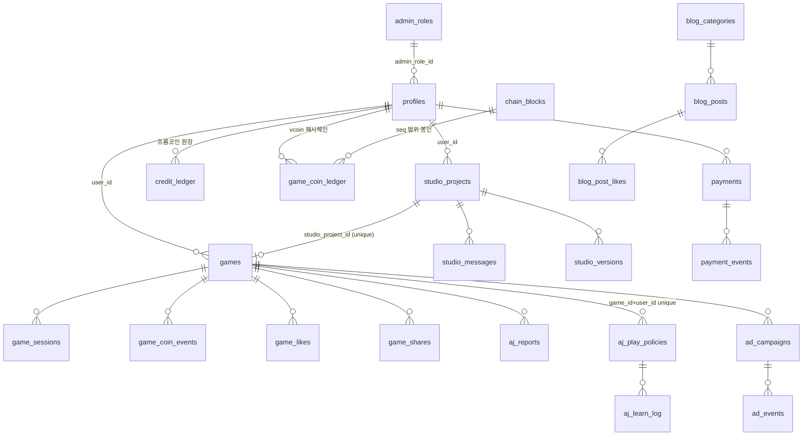

**테이블 그룹(30개 마이그레이션, 모두 멱등 SQL, Supabase SQL Editor 수동 실행)**

| 그룹 | 테이블 | 비고 |
|---|---|---|
| 코어 | `profiles`(vcoin default 1000, role, admin_role_id, banned_at, avatar_config, 동의 시각), `games`(coin_cost, teaser/teaser_en, studio_project_id, country), `game_likes`, `game_views` | 선행 테이블, ALTER로 확장 |
| 스튜디오 | `studio_projects`, `studio_messages`, `studio_versions`(html, notes), `credit_ledger`(합산 잔액, reason CHECK 7종), `studio_templates`, `prompt_mappings`, `llm_usage` | |
| AJ/학습 | `game_sessions`, `game_coin_events`, `aj_reports`, `aj_play_policies`(rules/params/brain/episodes/demos…), `aj_bot_curriculum`, `aj_learn_log`, `aj_talk_examples/rules/sources/feedback` | |
| 수익 | `payments`, `payment_events`, `ad_campaigns`, `ad_events`, `game_coin_ledger`(해시체인), `chain_blocks`, `wallets` | |
| 콘텐츠 | `blog_categories`, `blog_posts`, `blog_post_likes`, `notices`, `legal_docs`, `site_settings`(kv) | |
| 성장 | `tournament_applications`, `partner_applications`, `game_shares`, `geo_events` | |
| 운영 | `admin_roles`, `automation_logs`, `app_errors`, `visits`(ip_hash), `security_events` | |

**Storage**: `blog-images`(admin write), `avatars`(authenticated write), `thumbnails`.

**핵심 RPC**: `is_admin()`, `credit_balance()`, `spend_credits()`(advisory lock), `refund_credits()`(service_role 전용), `grant_signup_bonus()`, `spend_vcoin()`(관리자 무료), `create/fund/close_ad_campaign()`, `admin_dashboard_stats()`, `admin_list_members()`, `admin_set_role/ban()`, `admin_adjust_credits()`, `admin_purge_member()`, `game_coin_ledger_verify()`, `chain_seal_block()`.

**트리거**: `games_studio_project_owner`(남의 프로젝트 게시 차단), `games_default_country`, `profiles_protect_super_admin`, `profiles_vcoin_ledger`(해시체인 append).

### 3.6 권한 모델

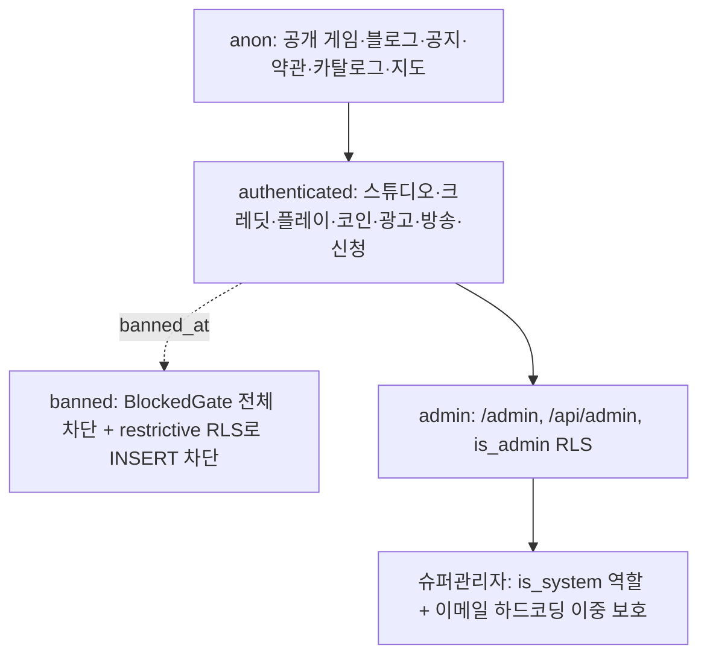

- 클라이언트가 Supabase를 직접 호출하는 경로가 많아 **RLS가 실질적 API 계층**을 겸한다.
- 서버 라우트는 대부분 service role + 명시적 소유권 검사(`requireAdmin()`, `ownerOf()`)로 대체.

### 3.7 크로스커팅

| 항목 | 구현 |
|---|---|
| i18n | `ko`/`en`, 쿠키 `vibrax-lang` → Accept-Language, 단일 URL 클라이언트 스위칭, 사전 ~578키 |
| PWA | `manifest.ts`, `sw.js`(`vibrex-v2`, `/api` `/play` `/studio` 캐시 금지, navigate network-first → `/offline`) |
| 텔레메트리 | `Telemetry.tsx`(PV·에러 sendBeacon), `useGameTelemetry`(세션 15초 flush), GTM |
| 로깅 | `app_errors`(fingerprint, 10분 5회 → 자동 공지), `visits`(IP 해시), `security_events` |
| 지오 | Vercel 지오 헤더만 사용, IP 미저장, 지도보드(한반도 중심 투영) |
| 레이트리밋 | 인스턴스 메모리 슬라이딩 윈도우(서버리스 인스턴스별) |
| 보안 헤더 | nosniff, SAMEORIGIN, HSTS 2년, Permissions-Policy(camera/mic self) |

---

## 4. 스튜디오: 프롬프트 → 게임 생성 파이프라인

### 4.1 전체 플로우

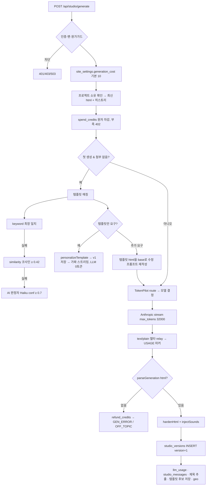

### 4.2 시스템 프롬프트 계약(`lib/studio/prompt.ts`)

- 출력: 한국어 설명 2~3문장 → `<game>` 완결 HTML `</game>`. 외부 리소스 금지(런타임 CSP `default-src 'none'`으로 강제). 무관 요청 → `<offtopic/>`.
- **매니페스트 표준**: `window.VIBREX_GAME = { title, genre, goal, clearCondition, controls, phase(), progress(), state(), start(), restart(), inputs{UAS} }`, 시작/재시작/클리어 DOM 역할(`data-vibrex-role`).
- **게임오버 ≠ 클리어**: 무한 러너도 목표를 두고 클리어 화면 필수.
- **아바타 참여 프로토콜**: `vibrex:avatar` 이벤트로 플레이어 스킨 교체, `vibrexAvatarAck()`.
- **오토파일럿 프로토콜**: `window.vibrexBot = {start, stop, setSkill}`, `VIBREX_POLICY` 규칙 실행.
- **AJ 텔레메트리**: `AJ.start/score/level/over/clear/restart`.
- **반응형**: 플랫폼이 터치 조이스틱을 자동 제공, 게임은 자체 버튼을 그리지 않음(`touchUI:'custom'` 예외).
- 히스토리는 최근 6턴, 역할 교대 강제, 이미지 첨부는 비전 블록.

### 4.3 하드닝 shim(`lib/studio/harden.ts`)

| shim | 위치 | 역할 |
|---|---|---|
| LS_SHIM | head | sandbox iframe에서 터지는 localStorage를 메모리로 대체 |
| AJ_SHIM | head | `window.AJ` → `parent.postMessage({type:'aj:event'})`, load/first_input 자동 발신 |
| AVATAR_SHIM | head | 스킨 주입, hue 역보정, 300ms ack 없으면 DOM 동반자 배지 |
| AUTOPILOT_SHIM | head | MLP 순전파(`nnAct`), 규칙 컴파일(화이트리스트), 데모 샘플러(200ms), 매니페스트 응답, 폴백 봇 루프(260ms) |
| TOUCH_SHIM | body 끝 | 플로팅 조이스틱 + A/B 버튼, 레거시 D-pad 숨김 |

`injectSounds()`가 첨부 사운드를 `window.VIBREX_SOUNDS` dataURL + `playSound()`로 주입(LLM은 오디오를 못 들으므로 이름·역할만 프롬프트에 전달).

### 4.4 템플릿 엔진 & 개인화

- 정적 템플릿 9종: tetris, breakout, snake, flappy, runner, runner-double, shooter, pong, stock(주식 떡상).
- 매칭: 최장 키워드 → FILLER 제거 후 잔여 ≤2자면 "템플릿만 요구".
- 개인화: 슬러그별 제목 변형 7~8개 + `hue-rotate` 9단계(stock은 의미색 보존을 위해 제외). 시드 = `userId:projectId`.
- DB 템플릿: 첫 생성이 미매칭이면 후보로 저장 → 관리자 승인(`templates.autoApprove` 기본 off) → 이후 LLM 없이 재사용.
- 관리자 오버라이드: 정적 템플릿 키워드/이름/비활성.

### 4.5 런타임 계약 & 메시지 프로토콜

**게임 → 부모**: `aj:event`(load/first_input/start/score/level/over/clear/restart/autopilot_on/off), `vibrex:avatar-received`, `vibrex:manifest`, `vibrex:demo`.
**부모 → 게임**: `vibrex:avatar`, `vibrex:avatar-remove`, `vibrex:policy`, `vibrex:brain`, `vibrex:autopilot`, `vibrex:manifest-request`.

### 4.6 서빙 보안

- `/play/[id]`: service role로 최신 버전 → `hardenHtml()` 재적용 → CSP `sandbox allow-scripts allow-pointer-lock; default-src 'none'; img-src data:; frame-ancestors vibrexcup.com …`, `X-Frame-Options: ALLOWALL`, `no-store`.
- `/play/ext/[id]`: 외부 게임 프록시. https 공인 호스트만, 사설 IP 차단, 12초 타임아웃, 2.5MB 제한, `<base>` 주입 후 하드닝 → 같은 오리진이 되어 AI 참여 가능.
- 프리뷰 iframe: `sandbox="allow-scripts allow-pointer-lock"` + `srcDoc`.

### 4.7 스튜디오 UI

- `/studio`: 프로젝트 목록·검색·게시 배지·삭제(게시 게임 동반 삭제), 새 게임 3분기(프롬프트/외부 링크/방송).
- `/studio/[id]`: 좌 최근 프로젝트 / 중앙 `StudioChat` / 우 `GamePreview`(버전·뷰포트·학습노트·AJ 대시보드·게시). 분할 비율 저장.
- 생성 진행 UI: 경과초·가짜 단계 6개·진행률·라이브 코드 tail. 완료 배너: "프롬코인 N 사용 · 잔액 M".
- 402 → 충전 안내, 503 → 원가 가드 사유 표시.

---

## 5. 보편 행동 공간(UAS)과 표준 관찰 슬롯

### 5.1 설계 원칙

> **조작은 게임마다 제각각이 아니라, 하나의 신경망이 이해할 수 있는 "보편 행동 공간" 위의 매핑으로만 표현한다.** 뇌의 고정된 운동 어휘처럼. 아이템 종류가 늘어도 버튼을 늘리지 않는다 → 신경망 출력 크기가 게임과 무관하게 고정 → 전이 학습 성립.

### 5.2 행동 채널(고정 순서)

| 그룹 | 채널 | 별칭 |
|---|---|---|
| 이동 | `left` `right` `up` `down` | |
| 주 행동 | `jump`(A) `fire`(B) `guard`(D) | `action≈fire`, `crouch≈guard` |
| 조준(선택) | `aimX` `aimY` (-1~1) | |
| 아이템 | `useItem`, `item1`~`item4`(퀵슬롯 4칸) | `action2≈useItem` |

장르 표준: 러너=jump(+guard 슬라이드) · 플랫포머=left/right+jump · 슈팅=이동+fire, useItem 특수무기 · 벽돌깨기/퐁=left/right · 탑다운=4방향+fire · 낙하블록=left/right, up 회전, down 빠른낙하 · 리듬=jump|fire 단일 · 레이싱=조향+up 가속+down/guard 브레이크.

### 5.3 관찰 슬롯(신경망의 감각)

정규화: 위치 0~1, 방향·속도 -1~1, 거리 0~1(가까울수록 작음).

| 그룹 | 슬롯 |
|---|---|
| 핵심 지각 | `targetDX/DY/Dist`, `dangerDX/DY/Dist`, `dangerETA`, `groundDist`, `onGround`, `selfVX/VY`, `facing` |
| 상태 | `score`, `lives`/`health`, `progress`, `fireReady` |
| 아이템 | `itemCount`, `activeItem`, `slot0Ready`~`slot3Ready` |
| 보조 | `danger2Dist`, `dangerCount`, `targetCount`, `selfX`, `selfY` |

### 5.4 신경망 채널 매핑(`coach/route.ts`)

- 입력 = `state()`의 유한 number 키 최대 **10개**, 출력 = 게임이 선언한 `inputs` 정규 순서 최대 **12개** → 최대 arch `[10, 6, 12]`(유전자 150개).
- 슬롯 시그니처가 바뀌면 두뇌 자동 리셋.

---

## 6. AJ: AI 스트리머 시스템

### 6.1 페르소나(`lib/ai-bj/personas.ts`)

| 장르 | 이름 | 톤 | 캐치프레이즈 |
|---|---|---|---|
| action | **ACE** | 짧고 강렬, 하이에너지 | "지금 이 순간이 전부야!" |
| adventure | **NOVA** | 신비로운 스토리텔러 | "미지의 세계로 함께 떠나자." |
| strategy | **LOGIC** | 냉정·분석, 수치 언급 | "최적의 수를 계산 중..." |
| sports | **SPARK** | 열정 캐스터 | "오늘도 최고의 경기를 기대해!" |

실제 표시명은 **게임 제작자 닉네임(agent_name)** 이 우선이고 장르 페르소나는 폴백. 제작자 아바타 = 그 게임의 BJ.

### 6.2 발화 파이프라인

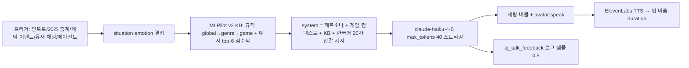

- 상황 라벨 16종(intro, commentary, reply, agent_reply, event_start/score/combo/fail/over/level/clear, hype, comfort, tease, ad, greeting, farewell), 감정 9종.
- 상대 말투 감지(언어·존댓말·긴장·기분) → 감정 자동 추론(down→empathy 등).
- 레이트리밋 40회/분, 로그인 필수.

### 6.3 패널 UX(`AiBjPanel.tsx`)

- 데스크톱: 게임 위 오버레이 채팅(좌하단, 최근 14개, 최근 3줄 항상 선명 + 픽셀 기반 페이드 마스크, 14초 유지 후 8초 페이드), "내역 펼치기"로 전체 보기. 아바타 무대(우하단, 드래그·크기 기억).
- 모바일: 좌하단 접이식 채팅 + 우하단 아바타.
- 음성 입력(ko-KR), 읽지 않은 배지, 아바타는 말할 때만 등장.
- 라이브(`bjLive`)가 있으면 아바타 대신 방송 영상이 BJ 자리를 차지.

### 6.4 유저 에이전트

18초마다 시청자의 AI 에이전트가 AJ에게 15자 이내 한마디(`/api/user-agent/chat`, Haiku). 채팅에 보라색 `agentName**` 마스킹 표시.

### 6.5 AJ 리포트(게임 경영 분석)

`/api/aj/analyze`(claude-sonnet-5, 4000 tok): 30일 세션 지표 + 코드 + 프롬프트 → `{fun_score, funnel 5단계(재미·체류·참여·전환·수익), insights, dropoff, suggestions(스튜디오 투입용 프롬프트), broadcast(오프닝·훅·쇼츠 대본·썸네일 제목), monetization, next_experiment}`. `/aj/[gameId]` 대시보드에서 실행, `/admin/aj`에서 크리에이터 랭킹.

### 6.6 라이브 방송

- **카메라**: `/broadcast`에서 getUserMedia → WebRTC P2P(시청자당 PeerConnection 1개, Supabase Realtime 시그널링, STUN 3개), wake lock, 이탈 시 keepalive OFF.
- **링크**: YouTube(watch/shorts/live/channel)·Twitch·iframe, 최대 20개, 게임 연결.
- **발견**: `profiles.avatar_config` 30초 폴링 → 피드에 2~4장 간격 `LiveCard` 삽입, 화면 밖이면 음소거·일시정지.

---

## 7. AI 아바타 학습 방식

### 7.1 설계 철학 — 왜 DQN/PPO가 아닌가

회원 게임이 수천 개이므로 게임당 GPU로 수만 판을 학습시키는 것은 비용·인프라상 불가능하다. 대신 **(1) 게임이 노출하는 표준 상태·행동, (2) 사람이 읽을 수 있는 규칙, (3) 정석 커리큘럼, (4) 가벼운 진화(신경진화·CEM), (5) LLM을 옵티마이저로 쓰는 자기 반성**을 조합한다. 학습 비용은 거의 0이고 "무엇을 배웠는지"가 사람에게 그대로 보인다.

### 7.2 여섯 가지 학습 경로

| # | 방식 | 누가 | 공유 범위 | 기록 시점 | 저장 |
|---|---|---|---|---|---|
| ① | AI 직접 플레이(오토파일럿) | AI | 나 | 매 판 종료 | `episodes`(≤40) |
| ② | 템플릿 기본기 커리큘럼 | 플랫폼 | 모두(단계별) | 2판 + 1시간마다 1단계 | `rules`, `template_skill`, `botSkill` |
| ③ | 프롬프트 코칭(말로 가르치기) | 나(채팅) | 나 | 가르칠 때 | `rules`, `tips` |
| ④ | 내 플레이 모방 | 나(플레이) | 나 | 75샘플(≈15초)마다 | `demos`(≤600) |
| ⑤ | 자기 반성 + 파라미터 진화 | AI | 나 | 3판마다 | `rules`/`params`, `best_rules`/`best_avg` |
| ⑥ | 개발자 가이드 | 제작자 | 그 게임의 모두 | 등록 시 | `aj_bot_curriculum(game:{id})` |
| ⑦ | **신경진화(MLP 유전 알고리즘)** | AI | 나 | 매 판(6판 = 1세대) | `brain` |

모든 결과는 **(게임 × 회원)** 단위 `aj_play_policies`에 저장되고 `/profile#learning`에서 확인한다.

### 7.3 신경진화 엔진(`lib/neuroevo.ts`)

| 항목 | 값 |
|---|---|
| 구조 | 3층 MLP `[입력 ≤10, 은닉 6, 출력 ≤12]`, 은닉 tanh, 출력 선형, 임계 0 |
| 개체군 | POP 6 |
| 엘리트 보존 | 2 |
| 선택 풀 | 상위 3 |
| 교배 | 유전자별 50% 균등 |
| 변이 | 유전자별 18% 확률, 가우시안 ×0.35 |
| 초기화 | gauss × 0.5 |
| 적합도 | 그 판의 점수 |
| 평가 | 라운드로빈 마이크로 평가(한 판 = 개체 1개), 6판 = 1세대 |
| 이력 | 최근 200세대 `{gen, best, avg}` |

순전파는 **게임 iframe 안**(AUTOPILOT_SHIM `nnAct`)에서 실행된다. 입력은 관측 최대값으로 러닝 정규화 후 clamp(-1,1), 출력 > 0이면 해당 UAS 채널 ON(엣지 트리거로 키 누름/뗌).

### 7.4 학습 루프(판 종료마다)

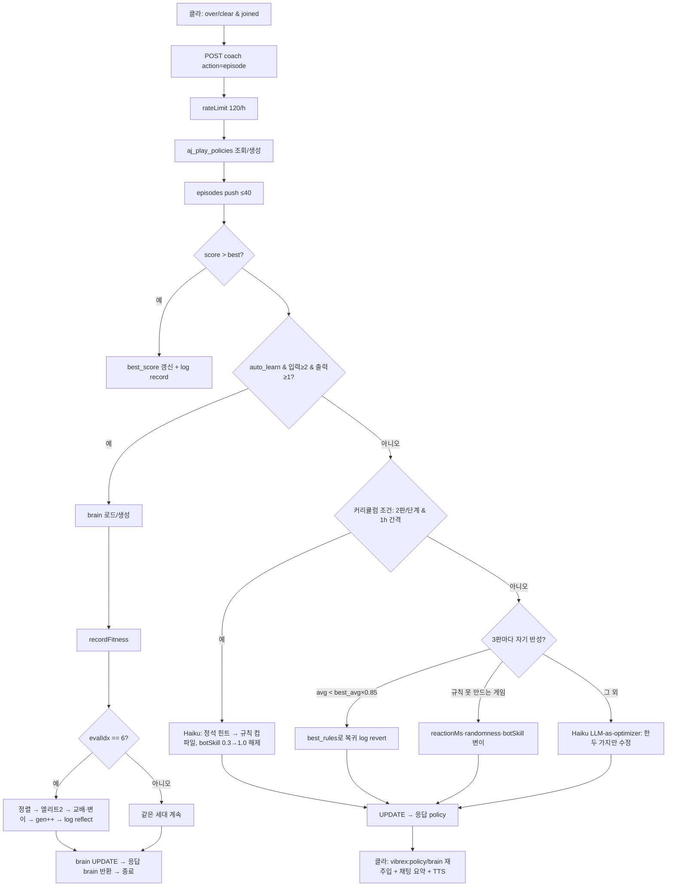

> **설계상 중요**: 신경진화 경로가 성공하면 early return 하므로, brain이 활성인 게임은 커리큘럼·자기 반성 경로가 실행되지 않는다. 규칙 경로는 관찰 슬롯이 부족한(number 상태 2개 미만) 게임이나 `brain` 컬럼 미적용 DB에서만 돈다.

### 7.5 데이터 플로우

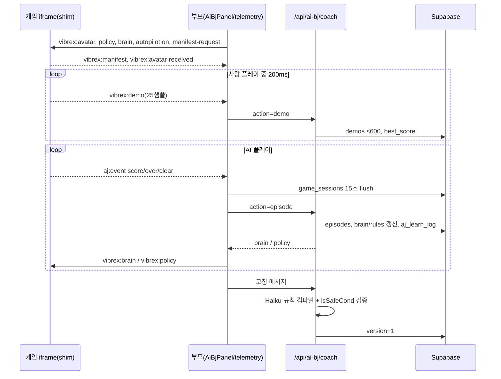

### 7.6 코칭 컴파일러

- 모델 `claude-haiku-4-5`, 1200 tok. 입력: 게임 메타·controls·inputs·state 키·샘플·현재 정책·데모 요약.
- 출력 JSON: `rules[{cond, action, hold, why}] ≤12`, `params{reactionMs, randomness, botSkill…}`, `tips`, `summary`(반말 10~25자).
- 검증: `isSafeCond`(토큰 화이트리스트, 200자, 위험 식별자 차단), action ∈ inputs, hold 30~1500.
- 데모 요약: 행동별 "누를 때 vs 안 누를 때" 평균 차이 상위 3 feature + 탭 9구역 빈도.

### 7.7 커리큘럼(정석 지식)

| 템플릿 | 단계 |
|---|---|
| tetris | 평평하게 → 구멍 금지 → 회전 맞춤 → 한 줄씩 → 우물+테트리스 → 높이 위험 관리 |
| breakout | 공 따라가기 → 낙하점 예측 → 가장자리 각도 → 옆 통로 |
| runner | 장애물 앞 점프 → 연속 장애물 → 아이템 동선 |
| flappy | 리듬 유지 → 틈 중앙 → 급강하 금지 |
| snake | 벽·몸통 회피 → 최단 경로 → 외곽 순환 → 꼬리 공간 |
| pong | y 추적 → 반사 예측 → 가장자리 타격 |
| shooter | 조준 → 탄막 회피 → 위험한 적부터 |

장르 폴백: action→breakout, sports→pong, adventure→runner, strategy→tetris. 병합 = 내장 + 관리자 DB + 제작자(`game:{id}`, 최대 20단계).

### 7.8 학습 대시보드

- 스탯 6종(세대·최고점·판수·규칙 수·기본기 n/m·자기 진화 횟수), 로그 8종 색상, "내 플레이로 학습" 버튼(20샘플↑).
- **XP 티어 20단계**: `xp = version×10 + rules×6 + template_skill×15 + (best>0?12:0)`, 필요 XP `60×1.28^i`. 새싹 → … → 비브렉스.
- `BrainNetwork3D`: three.js로 입력(하늘)/은닉(보라)/출력(핑크) 뉴런, 시냅스 양(초록)/음(빨강), 강한 엣지에 빛 입자 흐름.
- 신경망 없는 게임은 파라미터 게이지(실력·반응속도·무작위성)로 대체.

### 7.9 전제 조건

학습은 게임이 **표준 매니페스트(`state()`·`inputs`)** 를 노출해야 동작한다(2026-08-19 표준 도입 이후 게임·템플릿). 그 이전 게임·외부 링크 게임은 범용 봇(①)만 가능하고 ④⑤⑦ 데이터는 쌓이지 않는다.

---

## 8. 점토(Jeumto) 아바타 시스템

### 8.1 데이터

- `profiles.avatar_config`(jsonb, 공개 read): `{format:'jeumto', version:1, name, voice, previewUrl, blinkUrl, talkUrl, dataUrl, previewVersion:5, broadcast, broadcasts[]}`.
- 본체 `*.jeumto.json`(정점 오프셋 Int16 양자화·페인트·파츠·리그)과 스냅샷 PNG 3종(기본/깜빡임/말하기)은 `avatars/avatar-models/{userId}.*`에 저장.

### 8.2 에디터(`lib/jeumto/*`, 약 2,460줄)

- 균일 테셀레이션 rounded box(밀도 40), 브러시 push/pull/inflate/smooth, undo 30, 정점 페인트 12색.
- 파츠(눈·눈썹·입·코·기타)는 삼각형 index + 무게중심 좌표로 앵커 → 조각해도 따라감.
- 프리셋 8종(square/egg/bun/tall/rabbit/bear/cat/horn), 툰 셰이딩.
- 뷰어: 말하기 비즘 시퀀스 12프레임 + 머리 까딱 + idle 깜빡임.
- **사진 → 레시피**: `claude-sonnet-5` 비전이 `{preset, clayColor, name, parts[≤10]}` JSON 생성, 서버 화이트리스트·클램프.

### 8.3 게임에 실리는 경로

플레이 시 제작자 아바타(BJ)와 내 아바타를 모두 로드 → 무대에는 내 아바타 우선 → 참여 시 256px 스냅샷을 `vibrex:avatar`로 주입 → 게임이 플레이어 스킨 교체. ack 없으면(외부 게임) "응원 중 📣" 동반 모드.

---

## 9. 파일럿 엔진군: AI 자율 운영

| 엔진 | 역할 | 핵심 파라미터 | 위치 |
|---|---|---|---|
| **TokenPilot** | LLM 최저가 라우팅·원가 측정·원가 가드·외부 판매 API | 모델 tier(opus5/sonnet5/haiku3), MIN_TIER, pins, `targetMargin 3`, `krwPerCredit 50`, 가드 `maxRatio 0.6`/`minRevenue $20` | `lib/llm/*`, `lib/tokenpilot/*`, `/admin/costs` |
| **MLPilot v1** | 프롬프트→템플릿 매핑(LLM 없이 처리율↑) | similarity threshold 0.42, AI 판정자 Haiku conf 0.7, 키워드 자동 학습 | `lib/studio/mlpilot.ts`, `prompt_mappings` |
| **MLPilot v2** | AJ 대화 학습(KB + RAG-lite + 규칙 + 피드백) | 예시 ≤3000, 규칙 ≤300, 품질 점수 갱신, 고성과 승격 | `lib/mlpilot/*`, `/admin/mlpilot`, `/api/mlpilot/ingest` |
| **LLMPilot** | AI 검색 노출(robots·llms.txt·사이트 요약) | `allowUserBrowsing true`, `allowTraining false` | `lib/llmpilot/*`, `/admin/llmpilot` |
| **AdPilot** | 광고 캠페인 자동 크리에이티브·리인베스트 | 예산 = 7일 코인 20%(20~500), CPC 1~2 | `/api/ads/auto`, `lib/ads/pick.ts` |
| **AJ Brain** | 게임 경영 리포트 | sonnet-5 4000 tok | `/api/aj/analyze` |

### 9.1 자동화 스위치 13종(`site_settings.automation`, `/admin-ops`)

| 키 | 기본 | 동작 |
|---|---|---|
| `templates.autoApprove` | off | 신규 템플릿 후보 자동 승인 |
| `games.autoSpam` | on | 게시 직후 규칙+Haiku 스팸 심사 → 자동 삭제 |
| `notices.autoIssue` | on | 동일 에러 10분 5회 → 자동 공지 |
| `applications.emailAdmin` | on | 신청서 접수 시 관리자 메일 |
| `mlpilot.aiJudge` / `mlpilot.autoLearn` | on/on | AI 판정자 / 대화 학습 자동 승인 |
| `tokenpilot.guard` | on | 원가 가드 자동 모드 |
| `adpilot.autoCreative` | on | 광고 크리에이티브 자동 |
| `blog.autoPost` | on | 게임 출시 블로그 자동 게시 |
| `aj.autoReport` | off | 주간 AJ 리포트(예정) |
| `payments.autoRevoke` | on | 환불·차지백 시 크레딧 자동 회수 |
| `broadcasts.autoOff` | off | 24h 초과 방송 자동 종료 |
| `security.autoBlock` | off | 이상 트래픽 자동 차단 |

처리 내역은 `automation_logs`(ok/error/needs_review)로 남고 OpsBoard가 45초 폴링으로 "사람이 봐야 할 것 7종"을 노출한다.

---

## 10. 역할 정의(R&R)

### 10.1 사용자 역할

| 역할 | 권한/행동 | 게이트 |
|---|---|---|
| **방문자(anon)** | 피드·게임 상세·블로그·공지·약관·카탈로그 열람, 게스트 플레이(코인 없음, AJ 없음) | — |
| **회원** | 코인 넣기, 좋아요·공유·컬렉션, AJ 채팅, 아바타 제작, 학습 대시보드 | 약관 동의 필수 |
| **크리에이터** | 스튜디오 생성·게시, 외부 게임 등록, 코인 단가(1~100) 설정, 개발자 가이드 등록, AJ 리포트, 방송 | agent_name 필요 |
| **시청자/에이전트 주인** | 내 아바타 참여·코칭·모방 학습, 유저 에이전트 대화 | — |
| **광고주** | AdPilot 캠페인(예산·CPC·타게팅), 타 게임 홍보 의뢰 | 게임코인 보유 |
| **토너먼트 참가자** | 4부문 신청(부문당 1회), 소속 설정 | 로그인 |
| **파트너(학교·기업·기관)** | 인바운드 신청(비회원 가능) | — |
| **운영자(admin_roles 운영자)** | games·members·notices·blog 권한 | `profiles.role='admin'` |
| **슈퍼관리자** | 전체(`{"all":true}`), 역할·결제·보안·설정 | 이메일 하드코딩 + `is_system` |

### 10.2 AI 역할

| AI 역할 | 모델 | 책임 |
|---|---|---|
| **게임 생성기** | claude-sonnet-5 | 계약을 지키는 완결 HTML 생성·수정 |
| **조작 플래너** | claude-haiku-4-5 | 장르 인식 + 친숙한 조작안 2~3개 |
| **AI 판정자** | haiku, temp 0 | 프롬프트→템플릿 분류 |
| **AJ 스트리머** | haiku 40 tok | 중계·대화·응원(페르소나 4종) |
| **유저 에이전트** | haiku 80 tok | 시청자 대리 한마디 |
| **코치 컴파일러** | haiku 1200 tok | 말·정석·데모 → 실행 규칙 JSON |
| **자기 반성 옵티마이저** | haiku | 점수 기반 규칙 미세 조정 |
| **신경진화 두뇌** | 로컬 MLP | 매 프레임 UAS 행동 결정 |
| **AJ Brain(경영 분석)** | sonnet-5 4000 tok | 재미 점수·퍼널·개선 프롬프트·방송 대본 |
| **스팸 심사관** | haiku | 게시 게임 스팸·도박·성인·외부유도 판정 |
| **학습 노트 튜터** | haiku 5000 tok | 초등 3~4학년 톤 코드·시나리오 설명 |
| **티저 카피라이터** | haiku 150 tok | 한/영 훅 문구 |
| **출시 블로거** | LLM | 게임당 1회 400~700자 소개글 |
| **아바타 레시피(비전)** | sonnet-5 800 tok | 사진→점토 파츠 |
| **대화 라벨러** | haiku 3000 tok | 트랜스크립트 상황·감정 태깅 |

### 10.3 운영 팀 역할(제안 R&R)

| 역할 | 책임 | 도구 |
|---|---|---|
| 프로덕트 오너 | 로드맵·기획·우선순위, 템플릿 승인 정책 | `/admin/settings`, `/admin/templates` |
| 개발(풀스택) | Next/Supabase/LLM 파이프라인, 마이그레이션 실행, 배포(`vercel --prod --yes`, `deploy-admin.sh`) | repo, Vercel, Supabase SQL Editor |
| AI/ML 담당 | 프롬프트·UAS 표준·커리큘럼·MLPilot KB 큐레이션·원가 정책 | `/admin/mlpilot`, `/admin/costs`, `lib/studio/prompt.ts` |
| 운영(CS/신뢰안전) | 회원·밴·환불·스팸 검토·공지·에러 로그 | `/admin-ops`, `/admin/members`, `/admin/payments`, `/admin/logs` |
| 마케팅/성장 | 블로그·SEO·스토어·토너먼트·파트너·광고주 유치 | `/admin/blog`, `/admin/applications`, `/admin/ads`, `store-assets/` |
| 재무 | Paddle 정산·수수료·원가 비율·상금 재원 | `/admin/payments`, `/admin/costs` |

---

## 11. BM 기획서

### 11.1 재화 구조(3-tier)

| 재화 | 이름 | 용도 | 획득 | 현금성 |
|---|---|---|---|---|
| `credit_ledger` | **프롬코인(Credits)** | 생성·수정·템플릿 로드(1회 10) | Paddle 결제, 가입 30, admin_adjust | **유일한 실매출** |
| `profiles.vcoin` | **게임코인(VC)** | 코인 넣기(게임당 1~100), 광고 예산 | 가입 1,000, 캠페인 환급 | 미판매(해시체인 기록, 토큰 스냅샷 대비) |
| 외부 B2B | **TokenPilot API** | LLM 원가 라우팅 추정 | Bearer 키 | 과금 미구현 |

### 11.2 가격표

| 팩 | 가격 | 크레딧 | 크레딧당 | 보너스 | 생성 횟수 | 완성 게임 수(1+4) |
|---|---|---|---|---|---|---|
| Starter | $5 | 100 | 5.0¢ | — | 10 | 2 |
| Creator(인기) | $20 | 450 | 4.44¢ | +12% | 45 | 9 |
| Studio | $50 | 1,250 | 4.0¢ | +25% | 125 | 25 |

- 국가별 가격은 Paddle PricePreview 현지화 표시(자체 가격표 없음). 환불: 14일 내 미사용 전액.
- 생성 비용은 `site_settings.generation_cost`로 런타임 조정. 관리자도 동일 차감.

### 11.3 단위 경제(추정)

가정: 생성 1회 입력 ≈ 6k tok(시스템 프롬프트+히스토리+기존 HTML), 출력 ≈ 8k tok(게임 HTML 15~20k자). 단가 sonnet-5 $3/$15 per 1M.

| 항목 | 값 |
|---|---|
| LLM 원가/회 | ≈ $0.14 (₩190) |
| 판매가/회 | 10 크레딧 ≈ $0.40~0.50 (₩550~690) |
| 총마진 | ≈ 3× (TokenPilot `targetMargin 3`, `krwPerCredit 50` → 10크레딧 = ₩500 목표) |
| 템플릿 경로 | 원가 0, 판매가 동일 → 마진 100% |
| 수정(edit) | 입력이 커져 원가↑, 소규모 수정 haiku 다운그레이드 옵션(현재 off) |
| 부수 LLM | AJ 발화 ≈ $0.0003/건, 코칭 ≈ $0.002/건, 리포트 ≈ $0.07/건 |

원가 가드: 월 LLM 원가 / 매출 > 60%면 일반 사용자 생성 자동 차단(관리자 예외).

### 11.4 매출원 포트폴리오

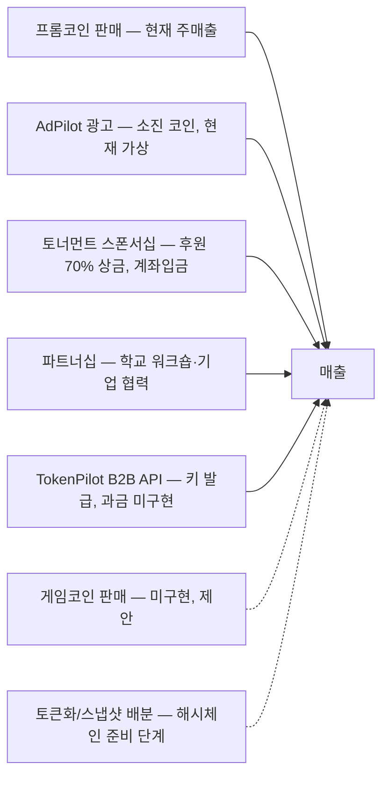

### 11.5 광고 모델(AdPilot)

- 인벤토리: 피드 게임 5장당 광고 카드 1장(`AJ PICK · 광고` 배지).
- 경매: `score = cpc × CTR(베이지안, 사전 4%) × fit(장르 1.3/0.6, 국가 1.4/0.5) × explore(노출<100 → 1.25) × 랜덤`.
- 과금: 클릭당 CPC 코인(10분 중복 무과금), 예산 소진 시 done, 종료 시 잔액 환급. 최소 예산 10, 최소 CPC 1.
- 성과: 노출·클릭·플레이 전환·ROAS(coins_earned ÷ spent).
- 자동 리인베스트: 7일 코인 수익 20%(20~500), CPC 1~2.
- **미구현**: AJ 방송 대사 내 광고 삽입(카피만 존재).

### 11.6 토너먼트

| 부문 | 규칙 | 1위 | 2위 | 3위 |
|---|---|---|---|---|
| 개인전 | 개인 최고 점수 | ₩1,000,000 | ₩500,000 | ₩250,000 (+상품권 30명) |
| 학교전 | 같은 학교 총점 | ₩1,000,000 | ₩500,000 | ₩250,000 |
| 세계전 | 국가별 총점 | ₩3,000,000 | ₩1,500,000 | ₩750,000 |
| 회사전 | 같은 회사 총점 | 추후 | 추후 | 추후 |

총상금 ₩8,750,000+(`site_settings.tournament_prize`), 후원금 70% 상금 환원 서약, 상태 OPENING SOON.

### 11.7 크리에이터 경제

- 수익 지표 = 자기 게임 `game_coin_events` 코인 합계(랭킹·리포트에 사용). 플레이 단가 1~100 자율.
- **현금화 경로 없음** → 토큰 스냅샷 배분(해시체인 + `wallets`)이 로드맵.

### 11.8 갭 및 제안

| 갭 | 제안 |
|---|---|
| 게임코인 유입이 가입 1,000뿐 → 디플레이션 | 프롬코인↔게임코인 교환 또는 게임코인 팩 판매, 일일 출석 보상 |
| 크리에이터 정산 없음 | 코인 수익 기반 월간 상금 풀 또는 토큰 스냅샷 |
| 광고 인벤토리 1종 | AJ 대사 광고(`situation:'ad'` 이미 라벨 존재), 게임 상세 페이지 슬롯 |
| Paddle 수수료 미차감 순매출 | 결제 관리에 수수료율 설정 |
| 환율 하드코딩(1380 등) | `site_settings` 환율 테이블 |
| plan/explain 무료 Haiku 호출 남용 여지 | 레이트리밋 추가 |

---

## 12. 마케팅 기획서

### 12.1 포지셔닝

- **카테고리**: AI 바이브코딩 게임 플랫폼(제작 + 스트리밍 + AI 아바타).
- **태그라인**: `VIBE CODED · AI STREAMED · YOUR GAME` / "바이브로 게임 만들고, AI가 STREAMING 한다".
- **차별 메시지**: "프롬프트 한 줄 = 게임 완성", "AI 스트리머가 내 게임을 방송", "내 AI 아바타가 대신 플레이하고 배운다", "광고주가 붙으면 AJ가 대신 광고".

### 12.2 메시지 하우스

| 청중 | 핵심 메시지 | 근거 기능 |
|---|---|---|
| 크리에이터 | 코딩 없이 10초 만에 게임, 즉시 방송·공유 | 히어로 고스트 타이핑, 템플릿 즉시 제공, 자동 티저·썸네일·블로그 |
| 플레이어 | 코인 넣고 바로 즐기는 아케이드 + 살아있는 AI 스트리머 | 피드 스냅, INSERT COIN, AJ 중계·TTS |
| 학생·학교 | 바이브코딩 수업 + 학교 대항전 | 학습 노트(초등 톤), 학교전, 파트너 워크숍 |
| 기업 | 사내 대항전·브랜딩·기술 협력 | 회사전, 파트너 혜택 4종 |
| 광고주 | AJ가 골라주는 광고, 코인으로 ROAS 측정 | AdPilot |

### 12.3 퍼널과 KPI

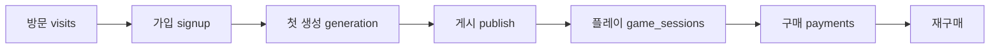

| 단계 | KPI | 측정 위치 |
|---|---|---|
| 방문 | 일 세션·PV·리퍼러·국가 | `/admin/access`, `visits` |
| 가입 | 가입 수·7일 증감 | `/admin` |
| 활성화 | 생성 횟수, 템플릿 처리율(LLM 0토큰 비율) | `/admin/costs`, `prompt_mappings` |
| 게시 | 게임 수, 스팸 차단율 | `/admin/games`, `automation_logs` |
| 리텐션 | 세션 길이·30초 이탈률·재시작률·클리어율 | `game_sessions`, AJ 리포트 |
| 수익 | 구매 크레딧·매출·환불율·원가 비율 | `/admin/payments`, `/admin-ops` |
| 성장 | 공유 수, 좋아요, 지도보드 핫스팟, 라이브 수 | `game_shares`, `geo_events` |

### 12.4 채널 전략(구현된 자산 기준)

| 채널 | 자산 | 상태 |
|---|---|---|
| **검색 SEO** | 키워드 39개(오타 변형 포함), JSON-LD(WebSite·VideoGame·BlogPosting), sitemap(게임·블로그·공지), RSS(네이버), Google/Naver 인증 | ✅ |
| **AI 검색(LLMPilot)** | `llms.txt`(인기 게임 60), `llms-full.txt`(500), `/api/catalog`, 인덱서 허용·학습봇 403 | ✅ |
| **콘텐츠 자동화** | 게임 출시 자동 블로그, 시스템 커밋 요약 블로그(스크립트), 티저 자동 생성 | ✅ |
| **소셜 공유** | OG 이미지, 카드 공유 버튼(`navigator.share`/클립보드), 공유 컬렉션 | ✅ |
| **앱 스토어** | Play Console 자산(아이콘·기능 그래픽·스크린샷·설명), iOS 워크스페이스 | 심사 준비 |
| **PWA** | 홈 화면 추가, 오프라인 셸, `utm_source=pwa` | ✅ |
| **토너먼트** | 4부문 신청 퍼널(가입 유도), 스폰서 명단 | OPENING SOON |
| **파트너/교육** | 학교·기업 인바운드, 3일 내 응답 SLA | ✅ |
| **이메일** | 마케팅 수신 동의(선택), Resend | 동의 수집만 |
| **광고** | AdPilot(플랫폼 내), GTM | ✅ |

### 12.5 캠페인 제안(향후 90일)

| 시기 | 캠페인 | 목표 | 채널 |
|---|---|---|---|
| M1 | 앱 스토어 런칭 + "프롬프트 한 줄 챌린지" | 가입 ↑, 첫 생성 전환 | 스토어, 블로그, 숏폼(AJ 리포트 `shorts_script` 활용) |
| M1~2 | 학교 파트너 10곳 워크숍 | 학교전 참가 팀 확보 | 파트너 페이지, 교육 커리큘럼(학습 노트) |
| M2 | 토너먼트 오픈(개인·학교·세계) | 플레이 세션·공유 ↑ | 토너먼트 페이지, 지도보드(국가별 핫스팟) |
| M2~3 | AJ 리포트 공개 랭킹 + 크리에이터 스포트라이트 블로그 | 크리에이터 리텐션 | `/admin/aj` 데이터, 자동 블로그 |
| M3 | 광고주 베타(게임 홍보 대행) | AdPilot 소진 코인 | `/ads`, 파트너 메일 |

### 12.6 브랜드 자산

- 마스코트 **점토이**(클레이 큐브, `#F05A28`/`#b93d16`/`#ff8a5c`), 로고 `LogoMark`(파란 배지 + 큐브).
- 팔레트: 주 `#2563eb`, 보조 `#06b6d4`, 골드 `#c9940c`, 배경 `#fcfaf5`, 텍스트 `#241f17`.
- 폰트: Pretendard Variable(본문), Jua(카드 훅 타이틀).
- 톤: 아케이드(INSERT COIN·PRESS START·코인 징글) + 스트리머 반말 + 점토 캐릭터 애니메이션.

---

## 13. 모바일 앱

| 항목 | 내용 |
|---|---|
| 구조 | Expo 52 + react-native-webview WebView 셸, `App.tsx` 단일 파일 |
| 식별 | 번들/패키지 `com.puritechlab.vibrexcup`, 스킴 `vibrexcup://`, UA `VibrexcupApp/1.0.0 (os)` |
| 네이티브 통합 | 하단 탭 5개(Home/Games/Create/Reward/My), 마스코트 스플래시·로더, Android 백버튼, 카메라·마이크 권한, 외부 링크 시스템 브라우저 |
| 브리지 | 웹 `NativeBridge`: `__vibexNav(path)` + `route` postMessage(탭 활성·몰입 화면 탭바 숨김) |
| 구글 로그인 | `skipBrowserRedirect` → `oauth` 메시지 → `openAuthSessionAsync` → `vibrexcup://auth?code` → `/auth/callback` 주입 |
| 스토어 정책 | `isNativeApp` → 프롬코인 구매 UI 숨김 + 웹 충전 안내 |
| 성능 분기 | `html.vbx-app`(애니메이션·글로우·그레인 off), `html.vbx-ios`(스냅 proximity) |
| 빌드 | Android: 로컬 Gradle `bundleRelease`(Node 20, JDK 17, Kotlin 1.9.24, versionCode 10), 키스토어 필수 보관. iOS: Xcode 아카이브 또는 EAS(`projectId` 미발급) |
| 심사 리스크 | App Store 4.8(Sign in with Apple), 3.1.1(디지털 재화), 4.2(WebView 래핑), 권한 설명 |

---

## 14. 운영·배포·보안·법무

### 14.1 배포

- 회원 앱: `vercel --prod --yes`(GitHub 자동배포 없음). 관리자 앱: `scripts/deploy-admin.sh`(worktree + project.json 스왑, `ADMIN_PROJECT_ID`).
- `vercel.json` 없음 → **Cron 미설정**. 주기 작업은 클라이언트 폴링·ISR·요청 트리거·수동 스크립트에 의존(예정: `chain_seal_block()` 10분, `aj.autoReport` 주 1회).
- DB 마이그레이션: 러너 없음, SQL Editor 수동 실행. 코드 전반에 "컬럼/테이블 없음" 방어 로직.

### 14.2 보안

| 계층 | 조치 |
|---|---|
| 웹훅 | Paddle IP 허용목록 + HMAC 서명 + event_id 멱등 + security_events |
| 게임 샌드박스 | CSP `sandbox` + `default-src 'none'`, 프리뷰 `sandbox` iframe, 외부 프록시 SSRF 방어 |
| 규칙 실행 | `cond` 화이트리스트 토크나이저(클라·서버 이중) |
| 크레딧 | `refund_credits` service_role 전용, advisory lock, 부분 unique 인덱스 |
| 게시 소유권 | 트리거 `NOT_PROJECT_OWNER` |
| 코인 원장 | append-only 해시체인 + UPDATE/DELETE revoke + 무결성 검증 RPC |
| 개인정보 | IP 해시 저장, 카드정보 미보관(Paddle), 광고·추적 쿠키 미사용 선언 |
| 봇 | AI 학습 크롤러 403, 검색 인덱서 허용 |
| 관리자 | 호스트 분리 + 레이아웃 리다이렉트 + `requireAdmin()` 3중 |

### 14.3 법무

- 약관·개인정보·환불·마케팅 4종, `legal_docs` 버전 관리(게시본 우선, 정적 폴백), ko/en.
- 수탁: Supabase, Vercel, Anthropic, Paddle. 준거법 대한민국. 만 14세 이상.
- 환불: 14일 내 미사용 전액, 영업일 5일 응답, EU/UK 강행규정 우선.

### 14.4 남은 운영 항목(2026-08 기준 메모)

- 미실행 SQL 후보 확인(payments/geo/ads/game-country), `PADDLE_API_KEY`·`TOKENPILOT_API_KEYS` 설정.
- 회원가입 이메일: 임시 service role 즉시 생성 라우트 → 커스텀 SMTP 후 클라이언트 `signUp`으로 복귀.
- 점검 모드·허용 IP·슈퍼관리자 이메일·GTM ID 하드코딩(재배포 필요).

---

## 15. 리스크·기술부채·로드맵

### 15.1 기술부채

| 항목 | 영향 | 제안 |
|---|---|---|
| `Database` 타입이 10개 테이블만 커버 → `as never` 캐스팅 다수 | 타입 안전성 | Supabase CLI 타입 생성 |
| 레이트리밋 인스턴스 메모리 | 서버리스에서 우회 가능 | Upstash/Redis |
| `postMessage` targetOrigin `'*'`, 오리진 미검증 | 스푸핑 여지 | 오리진 검사 |
| `user-agent/chat` 인증·리밋·usage 로깅 없음, `ai-bj/chat` usage 미기록 | 원가 누락·남용 | logUsage + rateLimit |
| 가이드 문서가 신경진화 미반영 | 문서 불일치 | 본 문서 §7로 대체 |
| `brainWeights`는 best 개체, 배포는 active 개체 | 대시보드≠실제 | 표시 옵션 |
| 코칭 규칙과 brain 공존 시 brain 우선 | 코칭 무시 가능 | 하이브리드(규칙 오버라이드) |
| `hardenHtml` 중복 가드가 문자열 포함 검사 | shim 누락 가능 | 마커 주석 기반 |
| Sidebar 데드코드 데이터 조회 | 불필요 쿼리 | 정리 |
| `expo prebuild` 재실행 시 signingConfig 소실 | 빌드 함정 | config plugin화 |

### 15.2 로드맵(제안)

| 분기 | 항목 |
|---|---|
| 단기 | 앱 스토어 출시, Vercel Cron(체인 봉인·주간 리포트·방송 자동 종료), SMTP 전환, 게임코인 충전 |
| 중기 | AJ 대사 광고, 크리에이터 상금 풀, 토너먼트 실시간 랭킹(학교·국가 총점), pgvector 기반 MLPilot v2 |
| 장기 | 온체인 앵커링·토큰 스냅샷 배분, 신경망 전이(게임 간 두뇌 공유), 멀티플레이 표준 |

---

## 16. AGI 로드맵 ①: 자율 게임 디자이너 루프

> **상태**: 설계 스펙(미구현). 본 장은 코드에 없는 제안이며, 기존 부품(AJ 리포트·생성 API·세션 텔레메트리·복귀 규칙·자동화 스위치)을 어떻게 이어 붙이는지 정의한다.

### 16.1 목표

**게임이 스스로 더 재미있어진다.** AJ가 게시된 게임의 플레이 지표를 읽고, 개선 프롬프트를 만들고, 새 버전을 생성해 일부 플레이어에게 먼저 보여 준 뒤, 지표가 실제로 좋아졌을 때만 채택한다. 사람은 켜고 끄기, 예산, 거부권만 가진다.

한 문장으로: `리포트 → 수정 프롬프트 → 새 버전 → 카나리 배포 → 지표 비교 → 채택 또는 복귀`를 사람 개입 없이 반복하는 폐루프.

### 16.2 왜 지금 가능한가

| 루프 단계 | 이미 있는 부품 | 위치 |
|---|---|---|
| 진단 | `collectGameMetrics()` 30일 세션 지표, AJ 리포트 `suggestions[{title, why, prompt, impact}]` | `lib/aj/metrics.ts`, `app/api/aj/analyze/route.ts` |
| 수정 | 생성 파이프라인(기존 HTML + 수정 프롬프트 → 새 버전), 하드닝, 스팸 심사 | `app/api/studio/generate/route.ts`, `lib/studio/harden.ts`, `/api/games/screen` |
| 배포 | `/play/[id]`가 최신 `studio_versions`를 서빙 | `app/play/[id]/route.ts` |
| 측정 | `game_sessions`(duration, score_max, game_overs, cleared, first_over_sec, autopilot) 15초 flush | `lib/aj/telemetry.ts` |
| 판단·복귀 | 자기 반성의 `best_avg × 0.85` 복귀 규칙, `automation_logs` needs_review | `app/api/ai-bj/coach/route.ts`, `lib/automation.ts` |
| 통제 | 자동화 스위치(`aj.autoReport` 기본 off), TokenPilot 원가 가드, `llm_usage` | `lib/automation.ts`, `lib/tokenpilot/guard.ts` |

빠진 것은 **버전을 둘로 나눠 서빙하는 능력, 세션에 버전 꼬리표를 붙이는 것, 실험 상태를 저장하는 테이블, 그리고 이 순서를 돌리는 스케줄러** 네 가지다.

### 16.3 범위

**포함**: 게시된 스튜디오 게임(내부 `/play/{projectId}`)만. 표준 매니페스트가 있는 게임이 우선이지만, 세션 길이·게임오버 수는 매니페스트 없이도 측정되므로 2026-08-19 이전 게임도 대상이 된다.

**제외**: 외부 링크 게임(코드를 수정할 수 없음), 게임의 장르·규칙·목표를 바꾸는 수정(같은 게임의 "튜닝"만 허용), 크리에이터가 끈 게임.

### 16.4 루프 개요

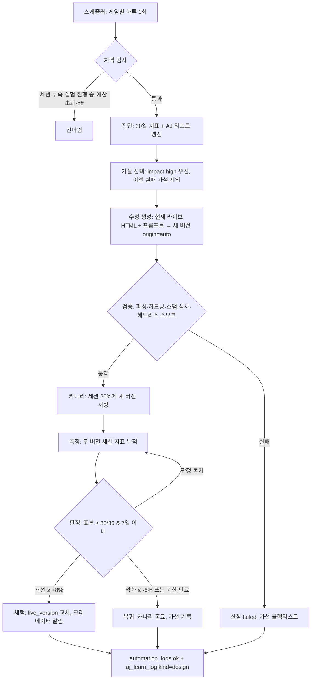

### 16.5 실험 상태 머신

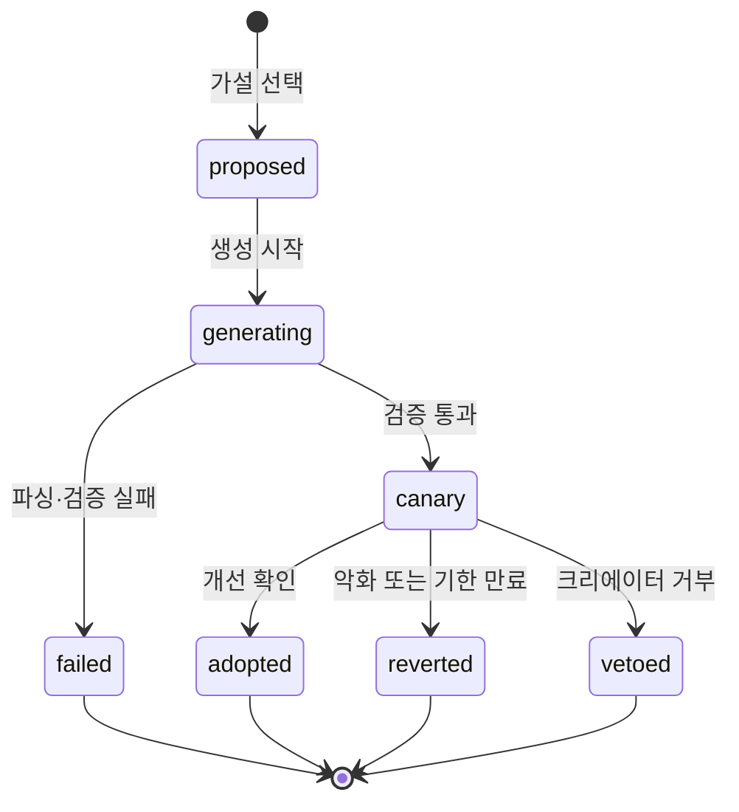

### 16.6 판정 기준

지표는 모두 `game_sessions`에서 나온다. 라이브(A)와 카나리(B)를 같은 기간에 비교한다(시간대·요일 편향 제거).

| 지표 | 정의 | 방향 | 가중치 |
|---|---|---|---|
| 초반 이탈률 | `duration_sec < 30` 비율 | 낮을수록 좋음 | 0.35 |
| 평균 체류 | `avg(duration_sec)` (상위 1% 절단) | 높을수록 | 0.25 |
| 재시작률 | `game_overs ≥ 2` 비율 | 높을수록 | 0.20 |
| 클리어율 | `cleared` 비율 (클리어 조건 있는 게임만) | 높을수록 | 0.20 |

- **복합 점수** = 지표별 상대 개선율(B/A − 1, 이탈률은 부호 반전)의 가중합.
- **채택**: 복합 점수 ≥ +0.08 이고 어떤 지표도 −0.10 이하로 악화되지 않음.
- **복귀**: 복합 점수 ≤ −0.05 이면 즉시. 표본이 차기 전이라도 이탈률이 A 대비 1.5배를 넘으면 조기 복귀(안전 밸브).
- **표본**: 각 버전 30세션 이상, 실험 기간 최대 7일. `autopilot = true` 세션과 제작자 본인 세션은 제외.
- 표본이 안 차면 `inconclusive`로 종료하고 다음 실험에서 같은 가설을 우선순위 뒤로 보낸다.

### 16.7 데이터 모델 변경(제안 SQL 요지)

| 대상 | 변경 |
|---|---|
| `studio_versions` | `origin text default 'user'` (`user` \| `auto`), `experiment_id uuid` |
| `games` | `live_version_id uuid`, `canary_version_id uuid`, `canary_ratio real default 0.2`, `auto_design boolean default false` |
| `game_sessions` | `version_id uuid` (플레이 시작 시 서빙된 버전) |
| 신규 `aj_experiments` | `id, game_id, project_id, base_version_id, candidate_version_id, hypothesis jsonb{title, why, prompt, impact}, status(proposed\|generating\|canary\|adopted\|reverted\|failed\|vetoed\|inconclusive), metrics_a jsonb, metrics_b jsonb, score real, started_at, decided_at, cost_usd, note` |
| `site_settings` | `automation['aj.autoDesign']`(기본 off), `aj_design{canaryRatio 0.2, minSessions 30, maxDays 7, adoptAt 0.08, revertAt -0.05, dailyBudgetUsd 5, perGameMonthly 4}` |
| `aj_learn_log.kind` | `design` 추가(크리에이터 학습 탭에 "AJ가 난이도 곡선을 조정했어" 표시) |

RLS: `aj_experiments`는 게임 소유자 read + admin all. 카나리 버전 서빙은 기존처럼 service role.

### 16.8 서빙 변경

`/play/[id]`는 지금 최신 버전을 내려준다. 변경 후:

1. `games.live_version_id`가 있으면 그것을, 없으면 최신 버전(현행 유지).
2. `canary_version_id`가 있으면 요청마다 `hash(session_id) % 100 < canary_ratio × 100`일 때 카나리 버전. 세션 ID는 `sessionStorage['vx_sid']`를 쿼리 `?s=`로 넘겨 같은 사람이 실험 중 같은 버전을 보게 한다.
3. 응답 헤더 `X-Vibrex-Version: {version_id}`와 HTML 주입 `window.VIBREX_VERSION_ID`를 두고, `useGameTelemetry`가 세션 INSERT에 `version_id`를 채운다.
4. 스튜디오 프리뷰와 버전 선택 UI는 영향 없음(`srcDoc` 경로).

### 16.9 생성 경로 분리

현재 `POST /api/studio/generate`는 사용자 세션과 크레딧 차감에 묶여 있다. 루프는 사용자 없이 돌므로 파이프라인의 순수 부분을 함수로 뽑는다.

- `lib/studio/pipeline.ts` (신규): `runGeneration({ projectId, prompt, baseHtml, history, task:'edit', actor:'system' })` → 모델 라우팅·스트림 수집·`parseGeneration`·`hardenHtml`·`studio_versions INSERT(origin='auto')`·`logUsage(kind:'auto_edit', credits:0)`.
- 기존 라우트는 이 함수를 호출하도록 리팩터링(동작 동일).
- 수정 프롬프트 접두: "이 게임의 장르·규칙·목표·조작은 그대로 유지한다. 아래 한 가지만 조정한다: …" 로 튜닝 범위를 강제. 시스템 프롬프트의 `<offtopic/>`·계약은 그대로 적용.

### 16.10 검증 게이트(카나리 전)

| 게이트 | 방법 | 실패 시 |
|---|---|---|
| 구조 | `parseGeneration` html 존재, `<title>` 존재, 바이트 수가 기준 대비 0.5~2.0배 | failed |
| 계약 | `VIBREX_GAME` 선언과 `inputs` 키 집합이 기준 버전과 동일(조작 변경 금지) | failed |
| 안전 | `hardenHtml` 적용, `/api/games/screen` 규칙 심사 통과 | failed |
| 스모크 | 헤드리스 크롬으로 5초 로드 → 콘솔 에러 0, `phase()`가 `title` 또는 `playing` 반환, 폴백 봇 3초 구동 시 `aj:event` 1건 이상 | failed |
| 원가 | 이 실험의 `cost_usd`가 게임별 월 예산·플랫폼 일 예산 안 | 건너뜀 |

### 16.11 안전장치와 통제

- **스위치**: `aj.autoDesign` 기본 off. 켜도 게임별 `games.auto_design`이 true인 게임만(크리에이터 opt-in).
- **빈도**: 게임당 동시 실험 1개, 하루 1회 시도, 월 4회 채택 상한.
- **예산**: 실험 1회 ≈ sonnet-5 수정 1회(≈ $0.14~0.25). 플랫폼 일 예산 기본 $5, TokenPilot 원가 가드가 차단하면 루프 전체 정지.
- **거부권**: 크리에이터는 AJ 대시보드에서 실험을 즉시 `vetoed`로 끝내고 라이브로 복귀시킬 수 있다. 채택 시 알림(공지·메일 선택)과 diff 요약을 받는다.
- **되돌리기**: 채택 후에도 이전 `live_version_id`를 `aj_experiments.base_version_id`로 보관하므로 1클릭 복귀.
- **감사**: 모든 전이가 `automation_logs(module:'aj', action:'design.*')`에 남고 OpsBoard "사람이 봐야 할 것"에 `failed`·`inconclusive` 누적 3회 이상 게임이 올라온다.
- **비용 귀속**: 자동 수정은 크레딧을 차감하지 않고 `llm_usage(kind:'auto_edit', credits:0)`로 플랫폼 원가로 잡는다. 채택된 버전이 만든 코인 수익 증분과 비교해 `/admin/costs`에 "자율 디자인 ROI"를 노출한다.

### 16.12 크리에이터 경험

- `/aj/[gameId]` 대시보드에 **"AJ에게 튜닝 맡기기"** 토글과 실험 카드(가설 → 카나리 진행률 → 두 버전 지표 막대 → 결과).
- 채택 시 채팅 형식 보고: "초반 3초 장애물을 늦췄더니 30초 이탈이 41% → 29%로 줄었어. 이 버전으로 바꿨어 (v7 → v8)".
- `/profile#learning` 학습 로그에 `design` 항목 색상 추가, XP 산식에 `adopted × 20` 반영.
- 스튜디오 버전 선택기에 `auto` 버전을 "AJ 튜닝" 배지로 구분.

### 16.13 시퀀스

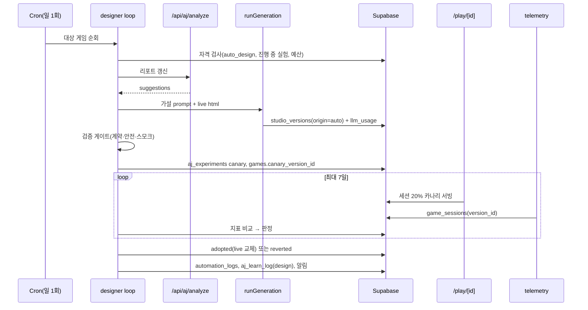

### 16.14 구현 계획

| 단계 | 작업 | 산출물 | 규모 |
|---|---|---|---|
| A. 기반 | 마이그레이션(§16.7), `/play` 버전 선택 + `version_id` 텔레메트리, `runGeneration` 추출 | 카나리 서빙이 수동으로 가능 | 2~3일 |
| B. 루프 | `lib/aj/designer.ts`(자격·가설·생성·검증·판정), `POST /api/admin/aj/design/run`(수동 트리거), Vercel Cron 1일 1회, 자동화 스위치·설정 | 관리자가 버튼으로 한 사이클 실행 | 3~4일 |
| C. 크리에이터 | 대시보드 실험 카드·토글·거부, 알림, 학습 로그·XP, 스튜디오 배지 | 크리에이터 opt-in 베타 | 2~3일 |
| D. 운영 | `/admin/costs` ROI 패널, OpsBoard 항목, 헤드리스 스모크 워커 안정화 | 전체 게임 대상 확대 | 2일 |

선행 조건: Vercel Cron 설정(`vercel.json`, 현재 없음), `aj.autoReport` 활성화, 헤드리스 크롬 실행 환경(Vercel 함수에서는 어려우므로 스모크 게이트는 외부 워커 또는 Playwright 서버리스 대안 검토).

### 16.15 KPI

| KPI | 목표(베타 8주) |
|---|---|
| 채택률 (adopted ÷ 실험) | ≥ 30% |
| 채택 버전의 30초 이탈률 개선 | 평균 −20% 상대 |
| 복귀율 (reverted ÷ 카나리) | ≤ 25% |
| 크리에이터 거부율 | ≤ 10% |
| 실험당 원가 | ≤ $0.30 |
| 자율 디자인 ROI (코인 수익 증분 ÷ 원가) | > 1 |

### 16.16 리스크

| 리스크 | 대응 |
|---|---|
| 지표 노이즈(표본 적은 게임) | 최소 30세션, 7일 상한, inconclusive 처리, 인기 게임부터 적용 |
| 게임이 "쉬워지기만" 하는 편향(이탈률 최적화) | 클리어율·재시작률을 함께 가중, 난이도 급락은 `first_over_sec` 2배 초과 시 별도 경고 |
| 크리에이터 의도 훼손 | 튜닝 범위 강제 프롬프트, 조작·규칙 변경 금지 게이트, 거부권, 1클릭 복귀 |
| 원가 폭주 | 스위치·일 예산·원가 가드·게임별 월 상한의 4중 제한 |
| 카나리 버전이 깨져서 사용자 노출 | 스모크 게이트 + 조기 복귀(이탈률 1.5배) |
| 신경진화 두뇌와의 충돌(버전이 바뀌면 state 키가 달라질 수 있음) | 계약 게이트가 `inputs`·`stateKeys` 동일성을 검사, 달라지면 실험 자체를 failed 처리 |

### 16.17 다음 단계로의 연결

이 루프가 돌면 `aj_experiments`에 "어떤 가설이 어떤 장르에서 효과가 있었나"가 쌓인다. 이는 (a) MLPilot v1 템플릿의 기본 난이도 곡선 개선, (b) 시스템 프롬프트의 장르별 튜닝 지침 자동 갱신, (c) AGI 로드맵 ②(게임 간 전이 두뇌)에서 새 버전에도 두뇌를 유지하는 규칙의 근거 데이터가 된다.

---

## 17. 부록

### 17.1 환경변수(이름만)

`NEXT_PUBLIC_SUPABASE_URL`, `NEXT_PUBLIC_SUPABASE_ANON_KEY`, `SUPABASE_SERVICE_ROLE_KEY`, `ANTHROPIC_API_KEY`, `NEXT_PUBLIC_PADDLE_ENV`, `NEXT_PUBLIC_PADDLE_CLIENT_TOKEN`, `NEXT_PUBLIC_PADDLE_PRICE_SMALL/MEDIUM/LARGE`, `PADDLE_WEBHOOK_SECRET`, `PADDLE_API_KEY`, `PADDLE_SANDBOX_API_KEY`, `TOKENPILOT_API_KEYS`, `RESEND_API_KEY`, `MAIL_FROM`, `ADMIN_NOTIFY_EMAIL`, `ELEVENLABS_API_KEY`, `IP_HASH_SALT`, `ADMIN_HOST`, `NEXT_PUBLIC_APP_MODE`, `NODE_ENV`.

### 17.2 LLM 사용 총괄

| 용도 | 모델 | max_tokens |
|---|---|---|
| 게임 생성/수정 | claude-sonnet-5 (이미지 시 강제) | 32,000 |
| 조작안 제안 | claude-haiku-4-5 | 400 |
| 템플릿 분류 | claude-haiku-4-5-20251001 (temp 0) | 60 |
| 학습 노트 | claude-haiku-4-5-20251001 | 5,000 |
| AJ 발화 | claude-haiku-4-5-20251001 | 40 |
| 유저 에이전트 | claude-haiku-4-5-20251001 | 80 |
| 코칭/커리큘럼/자기반성 | claude-haiku-4-5 | 1,200 |
| 대사 라벨링 | claude-haiku-4-5 | 3,000 |
| 티저 | claude-haiku-4-5-20251001 | 150 |
| 스팸 심사 | haiku | — |
| 아바타 레시피 | claude-sonnet-5 (비전) | 800 |
| AJ 리포트 | claude-sonnet-5 | 4,000 |
| 관리자 템플릿 생성 | claude-sonnet-5 | — |

단가(USD/1M tok): sonnet-5 3/15, haiku-4.5 1/5, opus-5 5/25. `KRW_PER_USD 1380`.

### 17.3 주요 파일 인덱스

| 영역 | 경로 |
|---|---|
| 미들웨어·설정 | `proxy.ts`, `next.config.ts`, `app/layout.tsx` |
| 스튜디오 | `lib/studio/{prompt,harden,templates,template-match,personalize,mlpilot,ai-judge,bot-curriculum,constants}.ts`, `app/api/studio/{generate,plan,explain}/route.ts`, `components/studio/*` |
| 학습 | `lib/neuroevo.ts`, `app/api/ai-bj/{coach,learning}/route.ts`, `components/profile/{AiLearningSection,BrainNetwork3D}.tsx` |
| AJ | `lib/ai-bj/personas.ts`, `components/AiBjPanel.tsx`, `app/api/ai-bj/chat/route.ts`, `lib/mlpilot/*`, `app/api/aj/analyze/route.ts`, `lib/aj/*` |
| 아바타 | `lib/jeumto/*`, `app/avatar/page.tsx`, `app/api/avatar/from-image/route.ts` |
| 결제 | `lib/paddle/*`, `app/api/webhooks/paddle/route.ts`, `components/CreditsClient.tsx` |
| 광고 | `lib/ads/pick.ts`, `app/api/ads/*`, `app/ads/page.tsx` |
| 원가 | `lib/llm/*`, `lib/tokenpilot/*`, `app/admin/costs/page.tsx` |
| 운영 | `lib/automation.ts`, `components/admin/OpsBoard.tsx`, `lib/security/*`, `lib/log/server.ts` |
| 피드 | `components/{GamesBrowse,GameCard,LiveCard}.tsx`, `components/home/*` |
| 방송 | `lib/broadcast.ts`, `lib/live/*`, `app/broadcast/page.tsx` |
| 모바일 | `mobile/App.tsx`, `components/NativeBridge.tsx`, `lib/isNativeApp.ts` |
| DB | `db/migrations/*.sql` |
| 설계 스펙 | `docs/superpowers/specs/*`, `docs/superpowers/plans/*` |

### 17.4 용어집

| 용어 | 뜻 |
|---|---|
| **AJ** | AI 스트리머. 장르 페르소나(ACE/NOVA/LOGIC/SPARK) 또는 제작자 아바타 |
| **점토이(Jeumto)** | 클레이 큐브 마스코트·아바타 포맷 |
| **프롬코인** | 생성용 크레딧(Paddle 판매) |
| **게임코인(vcoin)** | 아케이드 플레이·광고 예산용 코인(해시체인 기록) |
| **UAS** | 보편 행동 공간. 고정 조작 채널 표준 |
| **매니페스트** | `window.VIBREX_GAME` 표준 인터페이스 |
| **오토파일럿** | 아바타가 게임을 대신 플레이하는 모드 |
| **신경진화** | MLP 가중치를 유전 알고리즘으로 진화시키는 학습 |
| **TokenPilot / MLPilot / LLMPilot / AdPilot** | 원가·학습·AI 검색·광고 자율 운영 엔진 |
| **원가 가드** | LLM 원가/매출 비율 초과 시 생성 차단 |
| **Vibrex Chain** | 코인 원장 해시체인 + 블록 봉인(PoA 단일 노드) |
